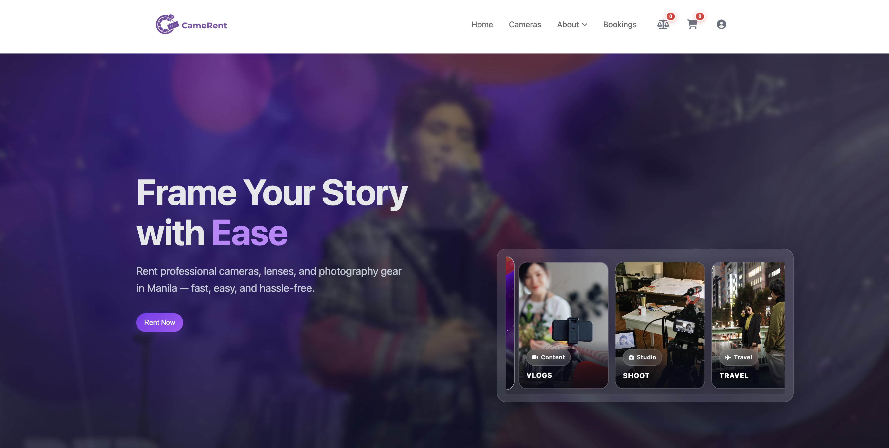
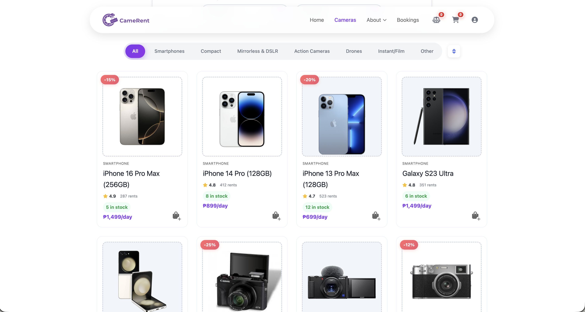
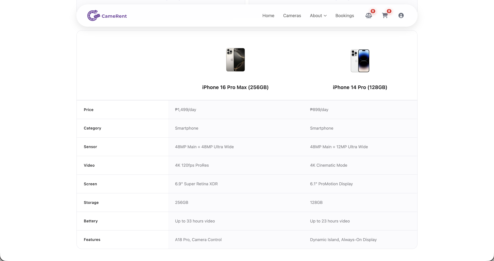
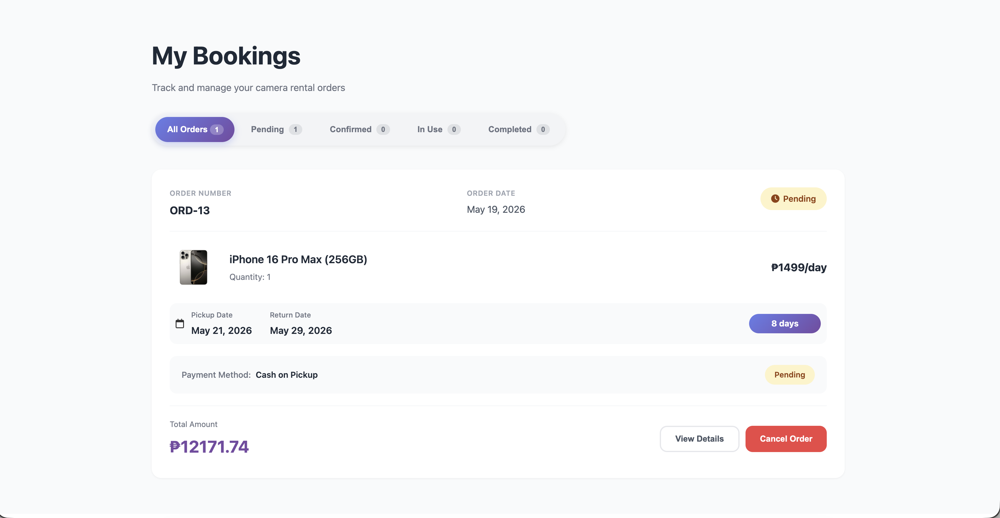
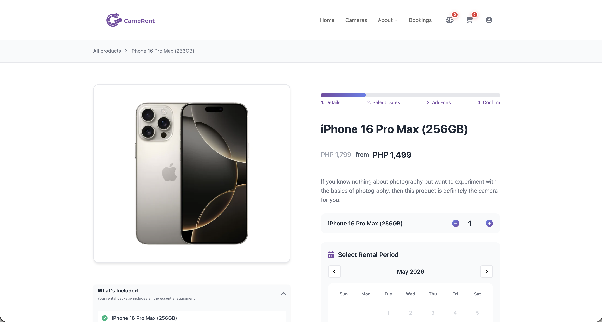
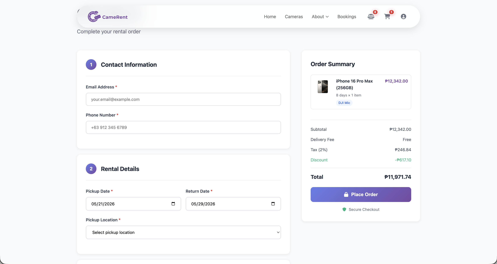
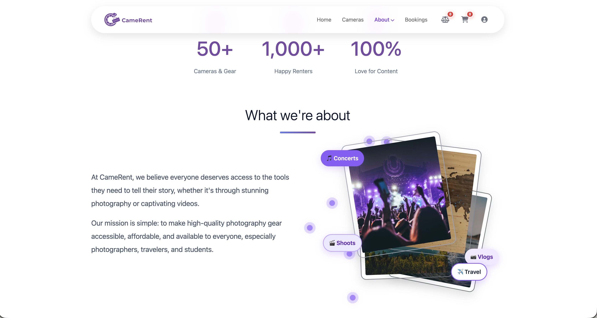

# CameRent

CameRent is a modern and user-friendly camera rental website developed to provide a seamless online experience for individuals looking to rent professional photography and videography equipment. The platform was designed to simplify the rental process by allowing users to browse available cameras, compare products, manage bookings, and complete transactions efficiently through a responsive and interactive interface.

The system aims to help content creators, students, photographers, travelers, and media enthusiasts access high-quality camera equipment without the need for expensive purchases. CameRent focuses on accessibility, convenience, and a smooth digital rental workflow while maintaining a clean and modern user experience.

# Website Preview

| Homepage | Products |
|---|---|
|  |  |

| Compare Page | Booking System |
|---|---|
|  |  |

| Checkout | Payment |
|---|---|
|  |  |

| Login Page | About Page |
|---|---|
|  |  |

## Key Features

* Responsive homepage and landing pages
* Camera catalog and detailed product pages
* Product comparison functionality
* Add-to-cart and checkout system
* Rental booking management
* User authentication and account management
* Admin dashboard for inventory and order monitoring
* FAQ, rental agreement, and resource pages
* Dynamic and interactive front-end interface

## System Functionalities

### User Side

* Browse and search camera equipment
* View camera specifications and rental details
* Compare products before renting
* Add products to cart
* Manage bookings and user profiles
* Access rental agreements and policies

### Admin Side

* Manage users and customer accounts
* Track and manage rental orders
* Monitor inventory and stock updates
* Handle booking records and transactions

## Technologies Used
Not so sure about this–

### Frontend

* HTML5
* CSS3
* JavaScript

### Backend

* Python
* SQLite

### Development Tools

* Visual Studio Code
* Git & GitHub

## Project Goal

The goal of CameRent is to create an efficient and visually appealing rental platform that improves the traditional camera rental process through digital convenience and organized inventory management. The project also serves as a practical application of web development, UI/UX design, and system integration concepts.

## Developers

* Shemaiah Ezra Magpayo
